# Kubernetes Authentication LDAP

<AdSenseTitle/>

本文介绍了两部分内容，如果您已经有 LDAP 在使用，请直接进入文档的第二部分内容。

* 安装 OpenLDAP
  
  > 仅用于配合此文档达成演示目的，部署到生产环境时，请参考 OpenLDAP 的官方网站
  
* 配置 Kubernetes/Kuboard 使用 OpenLDAP 登录

## 前提条件

* Kubernetes 集群版本不低于 v1.13
* Kuboard 版本不低于 v2.0.3-beta.2

## 安装/配置 OpenLDAP

本文描述的 LDAP 安装/配置方法仅仅是为了演示目的，生产环境请另外规划您的 LDAP 服务器安装，或者更大的可能性是，使用您企业中已经部署的 LDAP 服务。

* 下载文件 <a :href="$withBase('/practice/ldap/kuboard_ldap_example.yaml')" download="kuboard_ldap_example.yaml">kuboard_ldap_example.yaml</a>

* 打开 Kuboard 集群概览页，并创建名称空间 ***ldap-example***

* 进入名称空间 ***ldap-example*** 并点击 ***从 YAML 创建*** 按钮，将 kuboard_ldap_example.yaml 文件中的内容粘贴到弹出对话框，并点击 **保存** 按钮。

  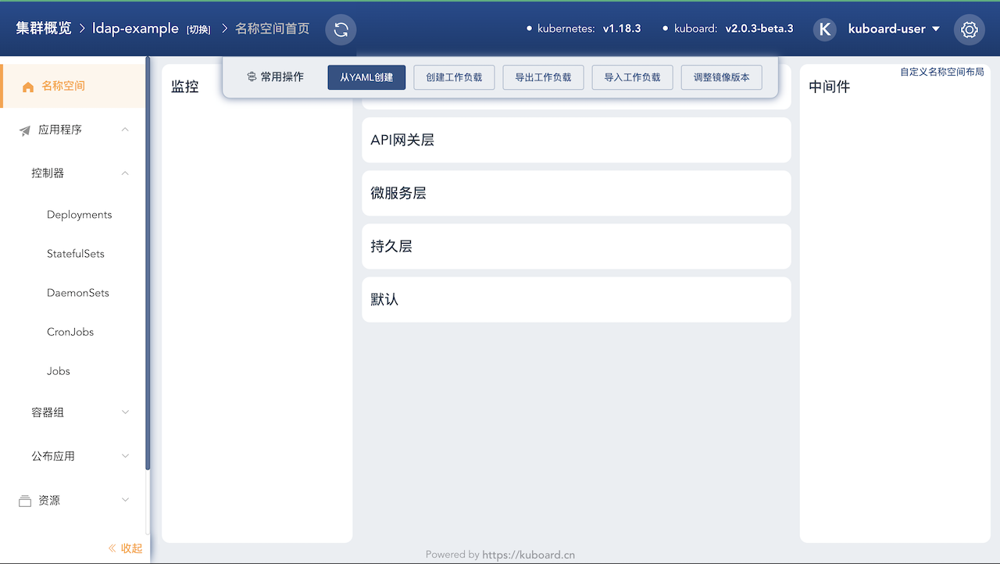
  
  完成创建后，稍等片刻，ldap / phpldapadmin 启动成功后，名称空间界面显示如下：
  
  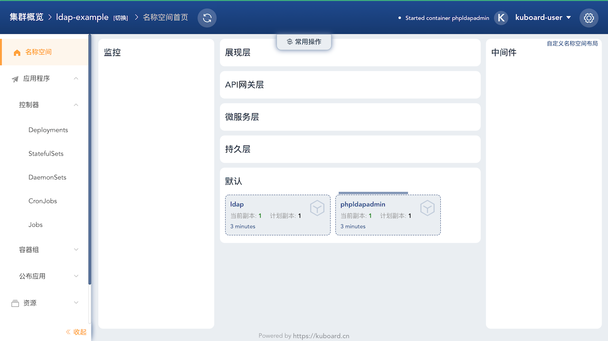

* 打开 LDAP 管理界面 phpldapadmin

  * 点击上图中的 phpldapadmin，进入工作负载查看页，如下图所示：

    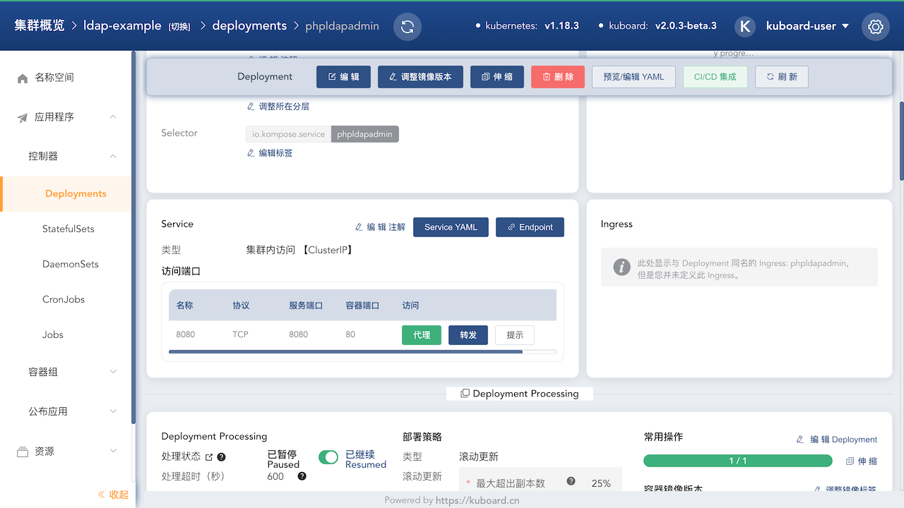

  * 点击 ***代理*** 按钮，打开代理对话框，如下图所示：

    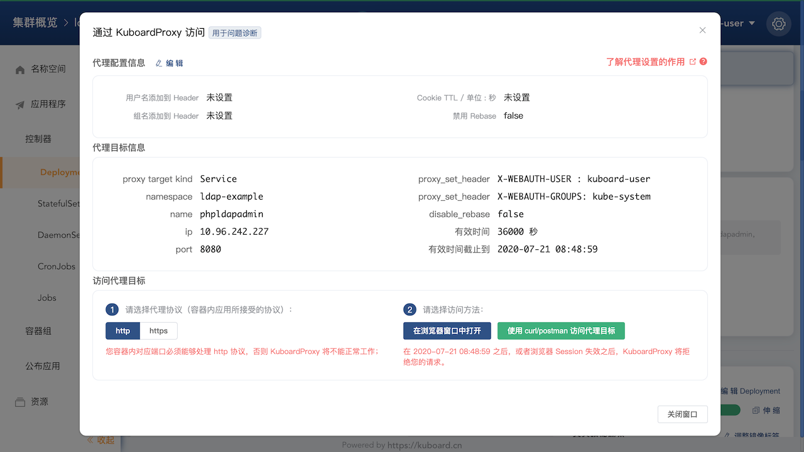

  * 点击上图中的 ***在浏览器窗口中打开*** 按钮，进入 phpldapadmin 首页，如下图所示：

    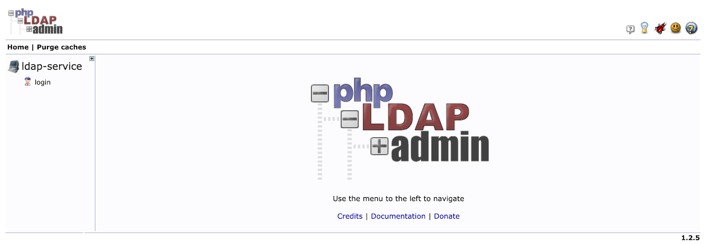

* 点击上图中的 ***login*** 按钮，登录 phpldapadmin 管理界面：

  登录时使用

  * 用户名：cn=admin,dc=example,dc=org

  * 密码： admin

  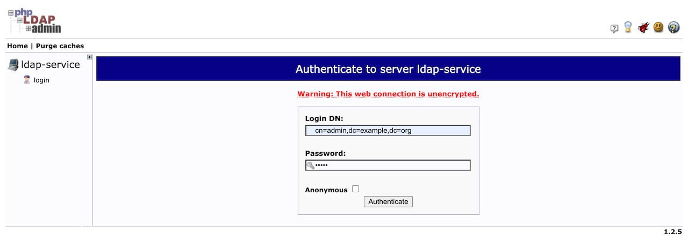

  登录成功后，界面如下图所示：

  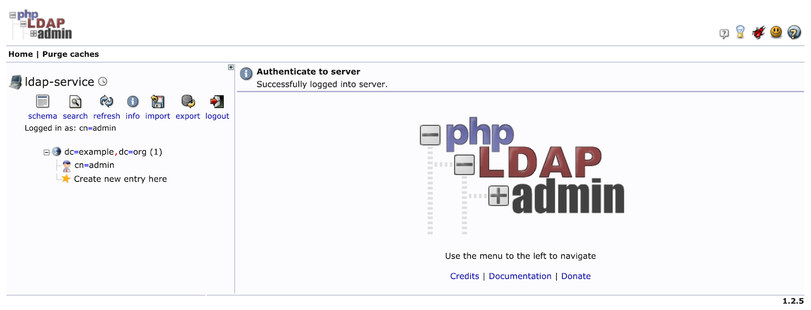

* 添加分组

  点击上图左侧的按钮 ***Create new entry here***，如下图所示：

  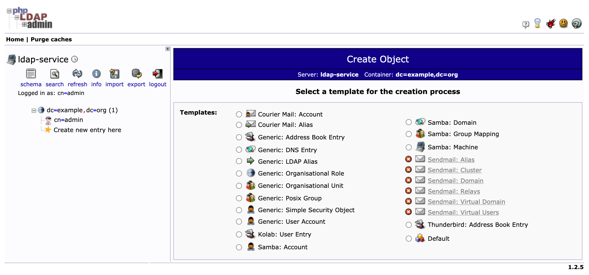

  点击上图中的 ***Generic: Posix Group***，如下图所示：

  输入表单如下，然后点击 ***Create Object*** 按钮，再点击 ***Commit*** 按钮，将完成 `mygroup` 的创建

  Group： `mygroup`

  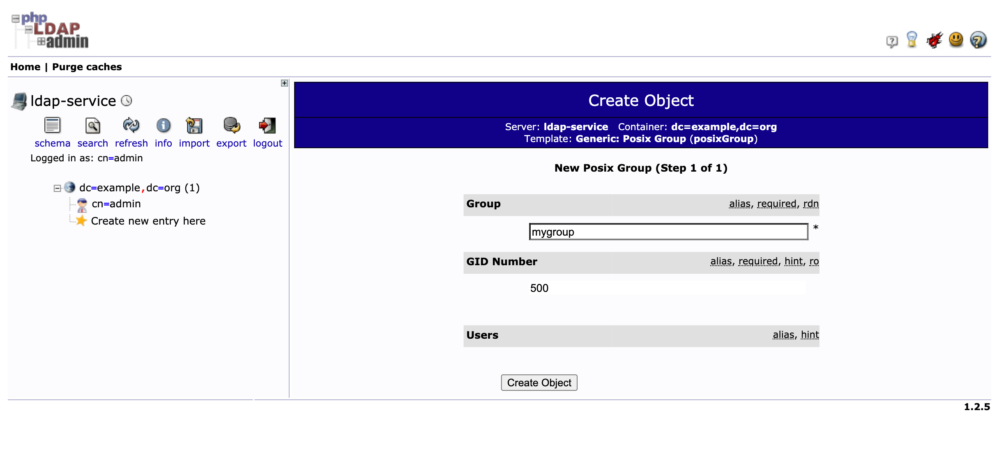

  

* 添加用户

  点击左侧的按钮 ***Create new entry here***，并选择 ***Genric: User Account***，如下图所示：

  输入表单如下：

  | 字段名称       | 字段值             |
  | -------------- | ------------------ |
  | First name     | hello              |
  | Last name      | world              |
  | Common Name    | hello world        |
  | User ID        | hworld             |
  | Password       | 123456             |
  | GID Number     | mygroup            |
  | Home directory | /home/users/hworld |

  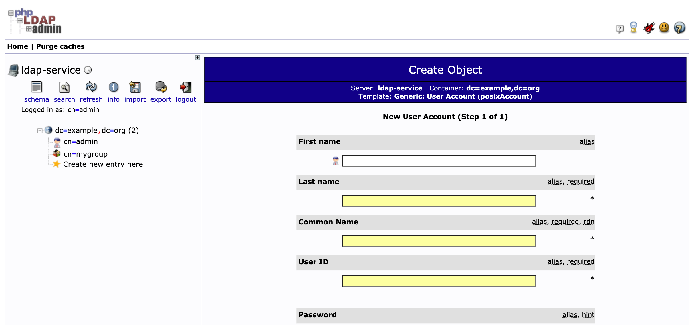
  
  完成表单填写后，点击 ***Create Object*** 按钮，再点击 ***Commit*** 按钮，将完成 `hworld` 用户的创建，如下图所示：
  
  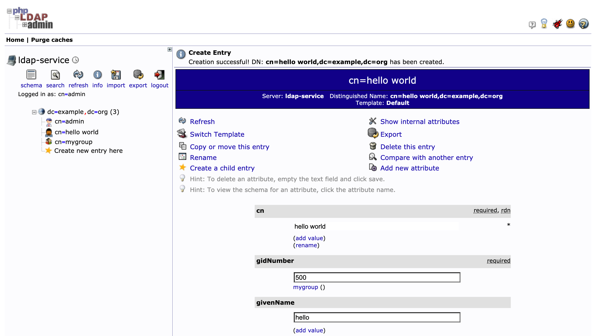
  
  点击上图右上侧的 ***Add new attribute*** 按钮，选择字段类型 `Email`，并输入 `hworld@kuboard.cn` 如下图所示：
  
  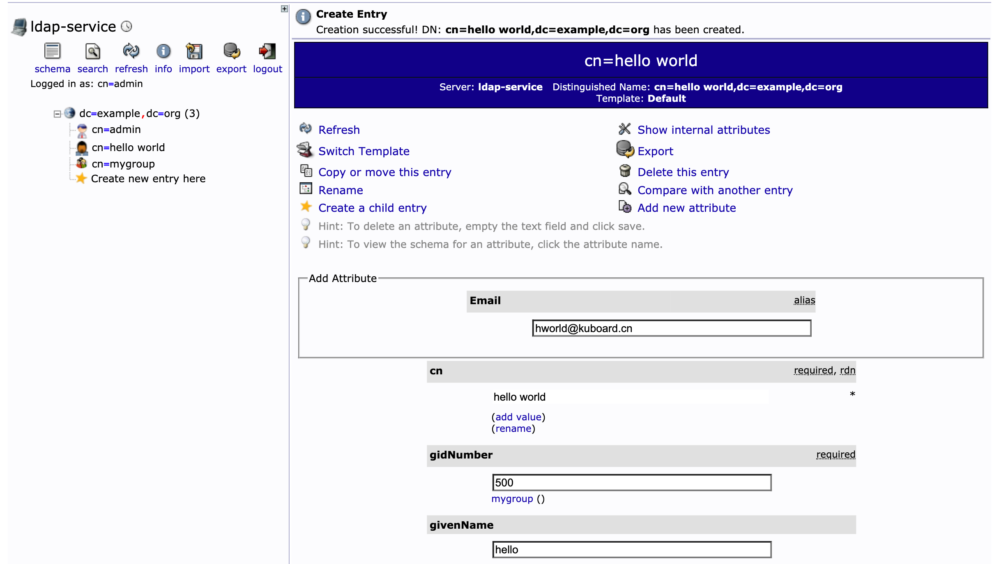
  
  然后点击页面末尾的 ***Update Object*** 按钮，在新的界面再点一次 ***Update Object*** 按钮以确认更新。

::: tip ldap 样例

此时我们已经准备好了用于演示的 LDAP 环境：

* 快速安装了一个 LDAP 服务实例（实际生产环境，请自行规划 LDAP 的安装，此文档中 LDAP 的安装方法只是用于 Demo 演示）；
* 创建了一个用户组 `mygroup`；
* 创建了一个用户 `hworld` ，归属于用户组 `mygroup`，其邮箱地址为 `hworld@kuboard.cn`，密码为 `123456`。

:::

## 配置 Kubernetes/Kuboard 使用 OpenLDAP 登录

* 登录 Kuboard 界面，并点击右上角的 *圆形* 按钮，进入设置菜单，点击左侧导航栏的 ***单点登录*** 菜单，如下图所示：

  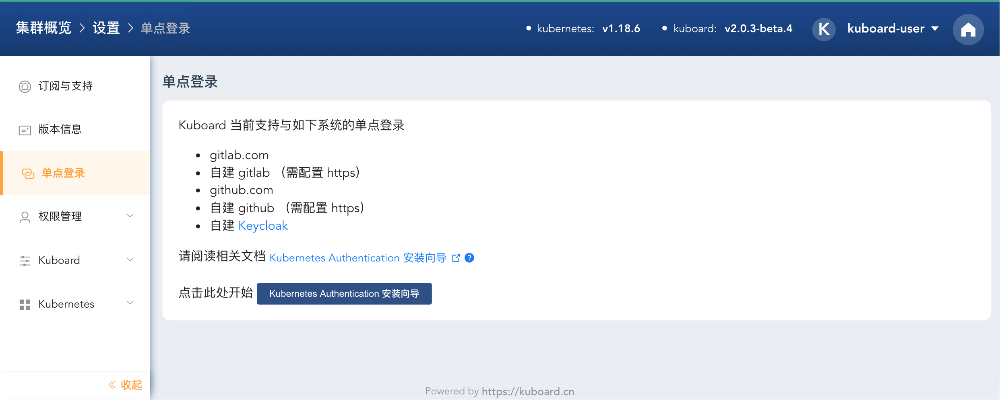

* 点击上图中的 ***Kubernetes Authentication 安装向导***，在该向导界面中填写表单：

  | 字段名称                                  | 字段值                                    | 说明                                                         |
  | ----------------------------------------- | ----------------------------------------- | ------------------------------------------------------------ |
  | 
认证模式
 | OpenID Connect                            | 请参考 [Kubernetes Authentication 安装向导](/learning/k8s-advanced/sec/authenticate/install.html) |
  | 安装方式                                  | 安装 Dex 以连接 identity provider         | 请参考 [Dex](https://github.com/dexidp/dex)                  |
  | Dex Connector                             | LDAP                                      |                                                              |
  | Dex DNS Name                              | dex.demo.kuboard.cn                       | 请修改为您自己的 dex 域名                                    |
  | Dex Node Port                             | 30100                                     | Kubernetes 的节点端口，必须可以被浏览器访问到                |
  | SSL 证书                                  | dex.demo.kuboard.cn 的 SSL 证书公钥及私钥 | 请为您的 dex 域名申请一个 SSL 证书（暂不支持自签名证书）     |

  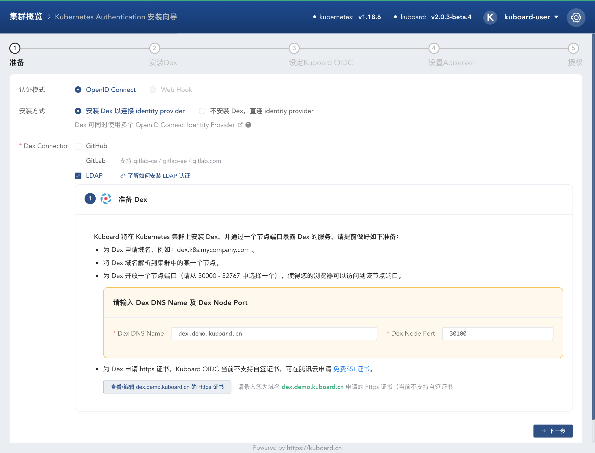

* 在上图中完成表单填写并点击 ***下一步*** 之后，将进入安装 Dex 的界面，如下图所示：

  填写表单：

  | 字段名称                            | 字段值                                      | 说明                                                         |
  | ----------------------------------- | ------------------------------------------- | ------------------------------------------------------------ |
  | Dex DNS Name                        | dex.demo.kuboard.cn                         | 请填写您自己的 Dex 域名                                      |
  | Dex Node Port                       | 30100                                       | 请填写您自己的 Dex 端口号                                    |
  | 基本参数-Id                         | ldap                                        |                                                              |
  | 基本参数-Name                       | LDAP                                        |                                                              |
  | 基本参数-usernamePrompt             | SSO Username                                | 显示在 Dex 登录界面上的提示信息                              |
  | LDAP 连接参数-host                  | ldap-service.ldap-example.svc.cluster.local | [安装/配置 OpenLDAP](#安装/配置 OpenLDAP) 章节中安装的 LDAP service 的全名（其中 cluster.local 为您 Kubernetes 集群的 [Domain Suffix](/learning/k8s-intermediate/service/dns.html#a-记录)）。如果您的 LDAP 服务器独立安装，请填写该 LDAP 服务器的域名或 IP 地址。 |
  | LDAP 连接参数-insecureNoSSL         | 不使用 SSL                                  | Demo 中没有为 LDAP Server 配置 SSL 证书，所以此处不使用 SSL；如果您的LDAP 激活了 SSL，此处可以选择使用 SSL；如果您的激活了 SSL，但是使用的是自签名证书，此处如果选择了使用 SSL，Kuboard 与 LDAP 的认证模块将不能正常工作。 |
  | LDAP 连接参数-bindDN                | cn=admin,dc=example,dc=org                  | Dex 使用此账号登录 LDAP，以执行 LDAP 查询操作                |
  | LDAP 连接参数-bindPW                | admin                                       | 密码                                                         |
  | 用户匹配方式-baseDN                 | dc=example,dc=org                           | 在此节点下查找用户信息                                       |
  | 用户匹配方式-filter                 | (objectClass=posixAccount)                  | 将此条件作为查找用户信息的过滤条件                           |
  | 用户匹配方式-username               | uid                                         | 登录时输入的用户名与用户信息的此字段进行匹配                 |
  | 用户匹配方式-idAttr                 | uid                                         | 将用户信息中的该字段 `uid` 映射到 token 的 id 字段           |
  | 用户匹配方式-emailAttr              | mail                                        | 将用户信息中的该字段 `mail` 映射到 token 的 email 字段       |
  | 用户匹配方式-nameAttr               | uid                                         | 将用户信息中的该字段 `uid` 映射到 token 的 name 字段         |
  | 用户匹配方式-preferredUsernameAttr  | uid                                         | 将用户信息中的该字段 `uid` 映射到 token 中的 preferredUsername 字段 |
  | 分组匹配方式-baseDN                 | dc=example,dc=org                           | 在此节点下查找分组信息                                       |
  | 分组匹配方式-filter                 | (objectClass=posixGroup)                    | 将此条件作为查找分组信息时的过滤条件                         |
  | 分组匹配方式-nameAttr               | cn                                          | 将分组信息中的该字段 `cn` 映射到 token 中分组的名字          |
  | 分组匹配方式-userMatchers-userAttr  | gidNumber                                   | 用户信息中该字段的 `gidNumber` 的值应该与分组信息中的 groupAttr 指定的 `gidNumber` 字段的值相匹配 |
  | 分组匹配方式-userMatchers-groupAttr | gidNumber                                   | 分组信息中该字段 `gidNumber` 的值应该与用户信息中通过 userMatchers.userAttr 指定的字段 `gidNumber` 的值相匹配； 例如，本例中，用户信息 `hworld` 的 gidNumber 的取值为一个数组，其中包含值 `500`，则，Dex 认为，gidNumber 字段取值为 `500` 的分组信息 `mygroup` 是用户 `hworld` 所在的分组之一。 |
  | Dex Client-id                       | kuboard-dex-client                          | 自动生成                                                     |
  | Dex Client-name                     | Kuboard for Kubernetes                      | 自动生成                                                     |
  | Dex Client-secret                   | mcedc4g27b5fnsjrktczwwes                    | 自动生成                                                     |
  | Dex Client-redirectURLs             | http://dev.kuboard.cn:32567/login           | 自动生成                                                     |

  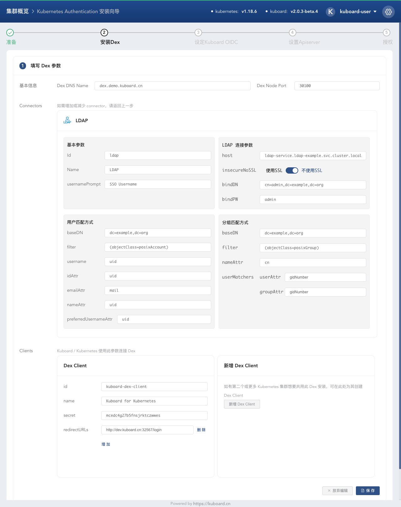

* 在上图中完成表单填写后，点击 ***保存*** 按钮，然后点击 ***安装*** 按钮，最后如下图所示：

  需要等候片刻，Kubernetes 才能完成 dex 的安装，安装完成后，界面会辅助您验证浏览器是否可以访问 Dex，如果可以，请勾选 ***已确认*** 按钮。

  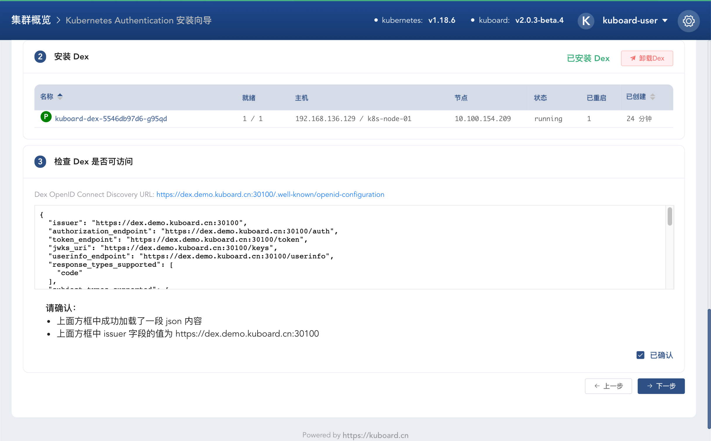

* 在上图中点击 ***下一步*** 按钮，将进入到对 Kuboard 进行设定的界面，如下图所示：

  请完成下图的表单（该表单的内容通常是自动生成，如果没有特殊情况，不建议修改）

  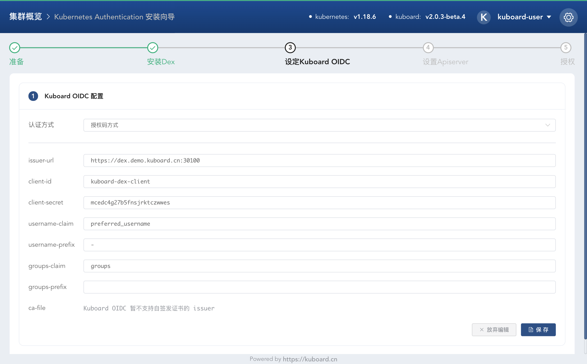

* 点击上图中的 ***保存*** 按钮，然后点击 ***应用 Kuboard OIDC 配置*** 按钮，如下图所示：

  等 Kuboard 完成更新后，界面将辅助您检测 Kuboard 的容器中是否可以访问 dex 服务，如果正常，您将看到绿色字体 ***Kuboard OIDC issuer*** 配置已应用，如下图所示：

  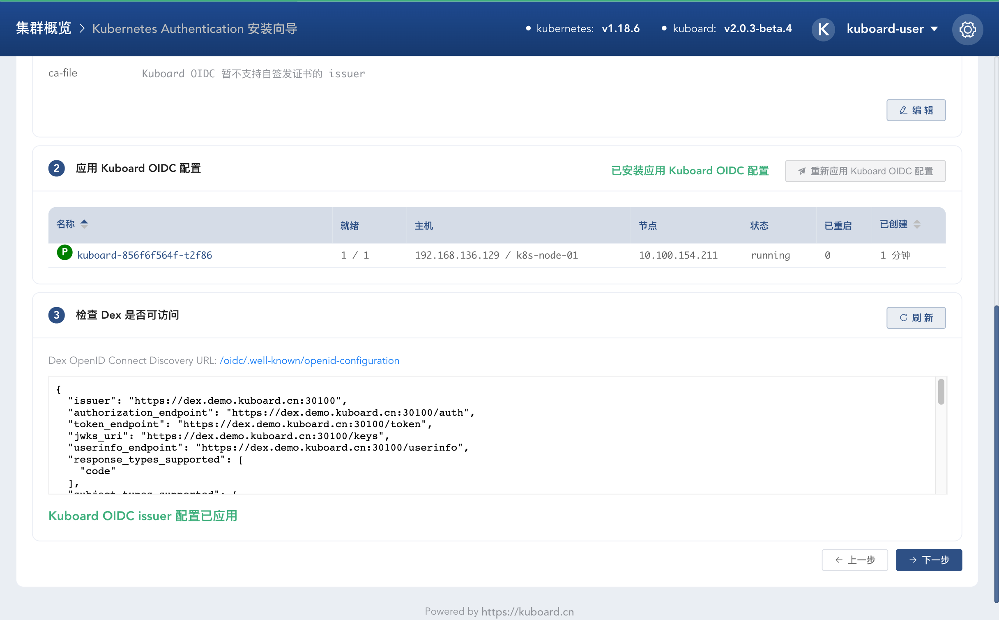

* 点击上图中的 ***下一步*** 按钮，按界面提示完成对 apiserver 的配置，配置成功后，如下图所示：

  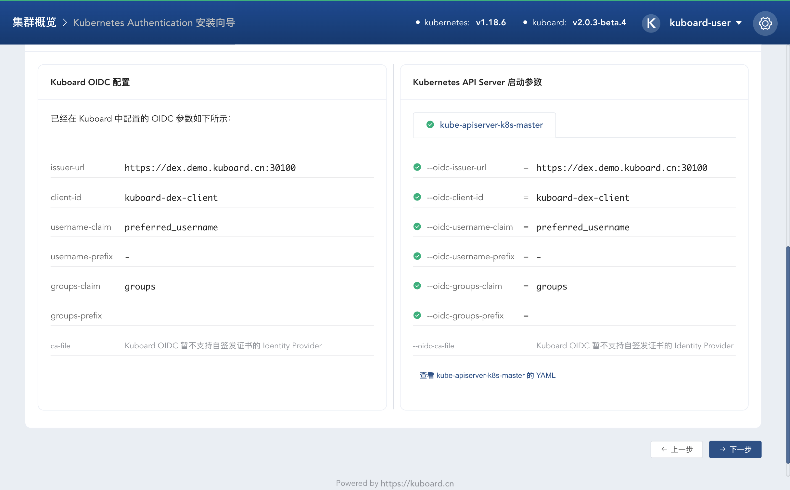

* 点击上图中的 ***下一步*** 按钮，您已经基本完成了 LDAP 认证的配置，接下来验证一下吧。

##验证 LDAP 登录

* 在新的浏览器（不同的浏览器，如果之前使用的是 chrome，建议现在使用 Firefox、IE 或者 Edge）中打开 Kuboard 界面，此时将默认显示用户名密码登录的 Tab，如下图所示：

  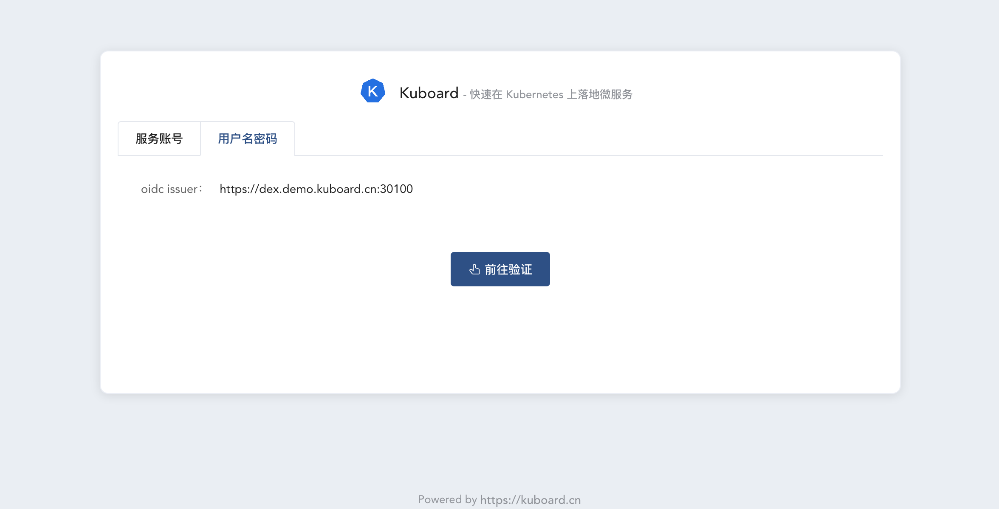

* 点击上图中的 ***前往验证*** 按钮，将显示如下界面：

  在此界面中输入：

  SSO Username：hworld （安装 LDAP 后，创建的测试用户）

  Password： 123456

  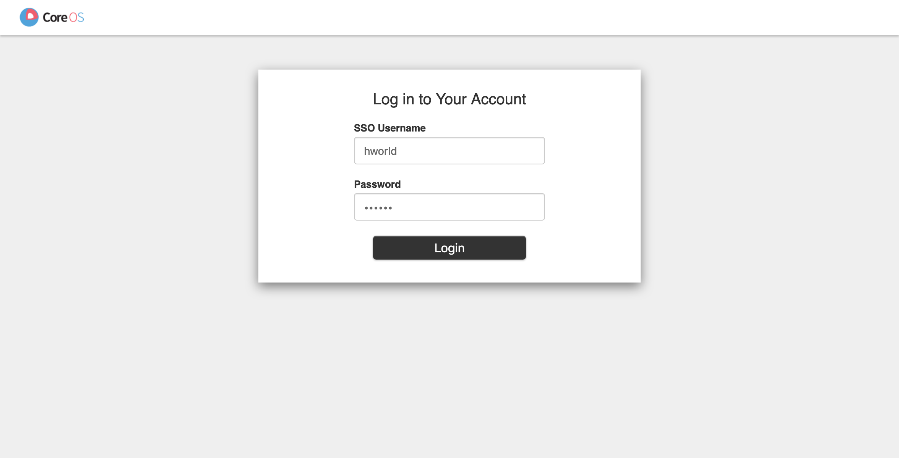

* 点击上图中的 ***Login*** 按钮，

  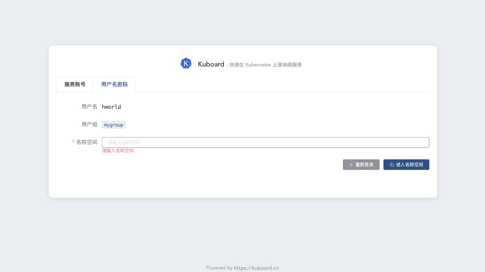

此时，您已经完成了 Kuboard/Kubernetes/Dex/LDAP 的集成，并且已经可以使用 LDAP 中的账号登录 Kuboard 界面。

> 界面上标识了已认证用户的用户名，以及所属的用户组。

为了能够进入名称空间，您还需要多做一小步工作，请参考：

* [授权用户访问指定名称空间](/learning/k8s-advanced/sec/rbac/user-namespace.html)
* [授权用户访问名称空间列表](/learning/k8s-advanced/sec/rbac/list-namespace.html)