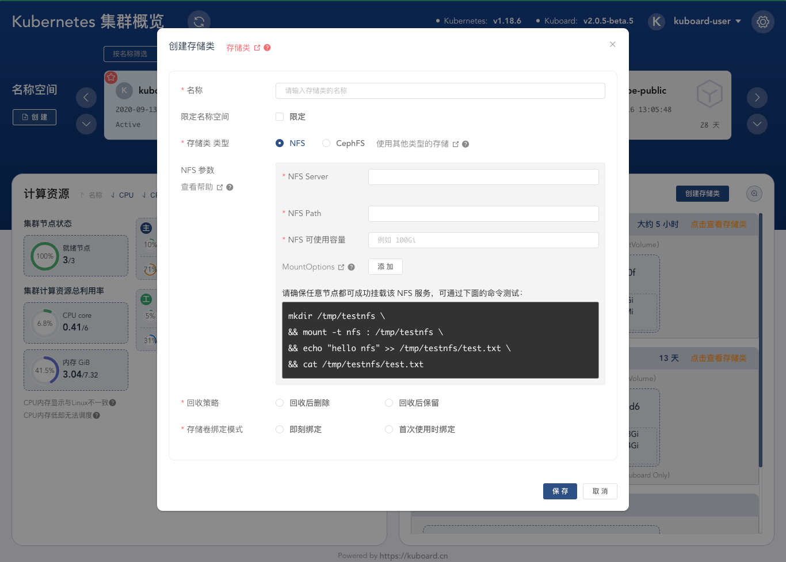

# 存储类StorageClass

<AdSenseTitle/>

参考文档： Kubernetes 官网 [Storage Classes](https://kubernetes.io/docs/concepts/storage/storage-classes/)

## 存储类概述

StorageClass 存储类用于描述集群中可以提供的存储的类型。不同的存储类可能对应着不同的：
* 服务等级（quality-of-service level）
* 备份策略
* 集群管理员自定义的策略

Kubernetes 自身对存储类所代表的含义并无感知，由集群管理员自行约定。

## 存储类的种类

参考 [Storage Classes](https://kubernetes.io/docs/concepts/storage/storage-classes/)，Kubernetes 提供 19 种存储类 Provisioner，但是绝大多数与具体的云环境相关，如 AWSElasticBlockStore / AzureFile / AzureDisk / GCEPersistentDisk 等。

Kuboard 支持的存储类的种类如下：
* NFS <Badge text="Kuboard 已支持" type="success"/>
* CephFS <Badge text="Kuboard 已支持" type="success"/> 
  * Kuboard 版本不低于 v2.0.5-beta.5

::: tip 使用Kuboard “不支持”的存储类
对于那些目前Kuboard不支持的存储类：
* 使用yaml文件在kubectl中创建存储类
* 在Kuboard中创建存储卷声明时，仍然可以引用这些存储类

这里所说的Kuboard不支持的存储类，仅仅是说，Kuboard中不能直接创建和编辑这种类型的存储类。
:::

::: tip NFS权限问题
许多网友自己搭建 NFS 测试环境，再创建 NFS存储类，经常碰到 `access denied` 这类权限问题。为了帮助大家更快地完成 NFS 测试环境搭建，Kuboard提供了一篇NFS相关的简明文档，请参考 [搭建NFS Server](/learning/k8s-intermediate/persistent/nfs.html)
:::

## 存储类

在 Kuboard 中查看存储类，如下图所示：

### 回收策略 Reclaim Policy

由 StorageClass 动态创建的 PersistentVolume 将使用 StorageClass 中定义的回收策略。可选项有：

* 回收后删除 Delete
* 回收后保留 Retain

同一 StorageClass 中，手动创建的 PersistentVolume，将使用创建时手动指定的回收策略。

### 存储卷绑定模式 Volume Binding Mode

StorageClass 根据存储卷绑定模式的选项，确定何时执行 存储卷与存储卷声明的绑定、何时执行动态存储卷提供（动态创建存储卷）。可选项有：

* 即刻绑定 Immediate

  存储卷声明创建后，立刻动态创建存储卷并将其绑定到存储卷声明。

* 首次使用时绑定 WaitForFirstConsumer

  直到存储卷声明第一次被容器组使用时，才创建存储卷，并将其绑定到存储卷声明。
