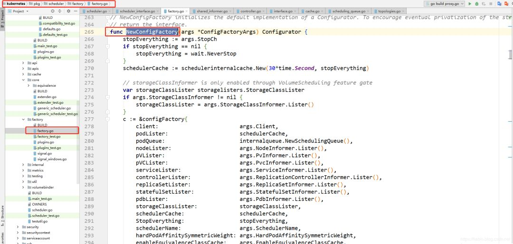
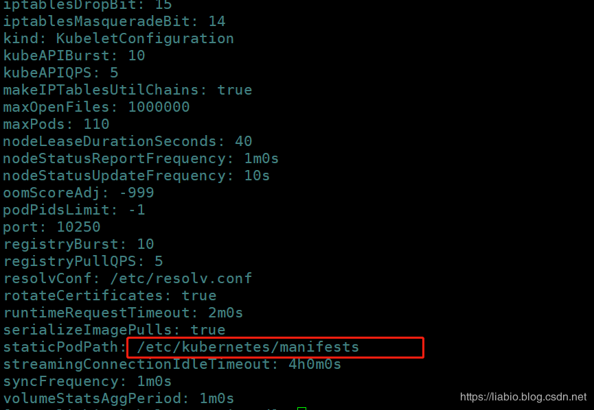

# CKA每日一题 --- Day 4

<AdSenseTitle/>

::: tip 考题

通过命令行，使用nginx镜像创建一个pod并手动调度到节点名为node1121节点上，Pod的名称为cka-1121，答题最好附上，所用命令、创建Pod所需最精简的yaml；如果评论有限制，请把注意点列出，主要需列出手动调度怎么做？

> 注意：手动调度是指不需要经过kube-scheduler去调度。

:::


<b-button v-b-toggle.collapse-join-error variant="danger" size="sm" style="margin-top: 1rem;" v-on:click="$sendGaEvent('cka-daily', 'cka-daily', 'CKA每日一题004')">答案及解析</b-button>
<b-collapse id="collapse-join-error" class="mt-2">
<b-card style="background-color: rgb(254, 240, 240); border: solid 1px #F56C6C;">

### 答案

将名称为cka-1121的Pod，调度到节点node1121：

``` yaml
apiVersion: v1
kind: Pod
metadata:
  name: cka-1121
  labels:
    app: cka-1121
spec:
  containers:
  - name: cka-1121
    image: busybox
    command: ['sh', '-c', 'echo Hello CKA! && sleep 3600']
  nodeName: node1121
```

### 解析

**官网中调度器地址：**

https://kubernetes.io/docs/concepts/scheduling/kube-scheduler/

中文地址： [https://kuboard.cn/learning/k8s-advanced/schedule/](https://kuboard.cn/learning/k8s-advanced/schedule/)

**调度器命令行参数：**

https://kubernetes.io/docs/reference/command-line-tools-reference/kube-scheduler/

**调度器kube-scheduler分为预选、优选、pod优先级抢占、bind阶段；**

**预选**：从podQueue的待调度队列中弹出需要调度的pod，先进入预选阶段，预选函数来判断每个节点是否适合被该Pod调度。

**优选**：从预选筛选出的满足的节点中选择出最优的节点。

**pod优先级抢占**：如果预选和优选调度失败，则会尝试将优先级低的pod剔除，让优先级高的pod调度成功。

**bind**：上述步骤完成后，调度器会更新本地缓存，但最后需要将绑定结果提交到etcd中，需要调用Apiserver的Bind接口完成。

> 以下k8s源码版本为1.13.2

我们去查看kube-scheduler源码，调度器通过list-watch机制，监听集群内Pod的新增、更新、删除事件，调用回调函数。指定nodeName后将不会放入到未调度的podQueue队列中，也就不会走上面这几个阶段。具体可以来到pkg\scheduler\factory\factory.go源码中的NewConfigFactory函数中：



其中在构建pod资源对象新增、更新、删除的回调函数时，分已被调度的和未被调度的回调。

**已被调度的回调：**

已被调度的pod根据FilterFunc中定义的逻辑过滤，nodeName不为空，返回true时，将会走Handler中定义的AddFunc、UpdateFunc、DeleteFunc，这个其实最终不会加入到podQueue中，但需要加入到本地缓存中，因为调度器会维护一份节点上pod列表的缓存。

```go
// scheduled pod cache 已被调度的
	args.PodInformer.Informer().AddEventHandler(        		
		cache.FilteringResourceEventHandler{
			FilterFunc: func(obj interface{}) bool{
				switch t := obj.(type) {
					case*v1.Pod://nodeName不为空,返回true;且返回true时将被走AddFunc、UpdateFunc、DeleteFunc,这个其实最终不会加入到podQueue中
						return assignedPod(t)
					case cache.DeletedFinalStateUnknown:
						if pod, ok := t.Obj.(*v1.Pod); ok {
							return assignedPod(pod)
						}
						runtime.HandleError(fmt.Errorf("unable to convert object %T to *v1.Pod in %T", obj, c))
						return false
					default:                    
						runtime.HandleError(fmt.Errorf("unable to handle object in %T: %T", c, obj))
						return false
					}
				},
			Handler: cache.ResourceEventHandlerFuncs{
				AddFunc:    c.addPodToCache,
				UpdateFunc: c.updatePodInCache,
				DeleteFunc: c.deletePodFromCache,
			},
		},
	)
```

**未被调度的回调：**

未被调度的pod根据FilterFunc中定义的逻辑过滤，nodeName为空且pod的SchedulerName和该调度器的名称一致时返回true；返回true时，将会走Handler中定义的AddFunc、UpdateFunc、DeleteFunc，这个最终会加入到podQueue中。

```go
// unscheduled pod queue 没有被调度的    
	args.PodInformer.Informer().AddEventHandler(        			
		cache.FilteringResourceEventHandler{
			FilterFunc: func(obj interface{}) bool{
				switch t := obj.(type) {
					case*v1.Pod://nodeName为空且pod的SchedulerName和该调度器的名称一致时返回true;且返回true时将被加入到pod queue
						return !assignedPod(t) && responsibleForPod(t, args.SchedulerName)
					case cache.DeletedFinalStateUnknown:
						if pod, ok := t.Obj.(*v1.Pod); ok {
							return !assignedPod(pod) && responsibleForPod(pod, args.SchedulerName)
						}                    
						runtime.HandleError(fmt.Errorf("unable to convert object %T to *v1.Pod in %T", obj, c))
						return false
					default:
          	runtime.HandleError(fmt.Errorf("unable to handle object in %T: %T", c, obj))
          	return false
          }
         },
         Handler: cache.ResourceEventHandlerFuncs{
         	AddFunc:    c.addPodToSchedulingQueue,
         	UpdateFunc: c.updatePodInSchedulingQueue,
         	DeleteFunc: c.deletePodFromSchedulingQueue,
  	     },
     },
  )
```

**手动调度适用场景：**

- 调度器不工作时，可设置nodeName临时救急 ；
- 可以封装成自己的调度器；

**扩展点：**

- 过去几个版本的Daemonset都是由controller直接指定pod的运行节点，不经过调度器。
- 直到1.11版本，DaemonSet的pod由scheduler调度才作为alpha特性引入


**昨天的留言中，有人提到static Pod，这种其实也属于节点固定，但这种Pod局限很大，比如：不能挂载configmaps和secrets等，这个由Admission Controllers控制。**

下面简单说一下静态Pod：

**静态Pod官网说明：**

https://kubernetes.io/docs/tasks/configure-pod-container/static-pod/

静态 pod指在特定的节点上直接通过 kubelet守护进程进行管理，APIServer无法管理。它没有跟任何的控制器进行关联，kubelet 守护进程对它进行监控，如果崩溃了，kubelet 守护进程会重启它。Kubelet 通过APIServer为每个静态 pod 创建 镜像 pod，这些镜像 pod 对于 APIServer是可见的（即kubectl可以查询到这些Pod），但是不受APIServer控制。

具体static pod yaml文件放到哪里，需要在kubelet配置中指定，先找到kubelet配置文件：

```
systemctl status kubelet
```


找到config.yaml文件：


里面指定了staticPodPath：



kubeadm安装的集群，master节点上的kube-apiserver、kube-scheduler、kube-controller-manager、etcd就是通过static Pod方式部署的：


</b-card>
</b-collapse>

> CKA 考试每日一题系列，全部内容由 [我的小碗汤](https://mp.weixin.qq.com/s/5tYgb_eSzHz_TMsi0U32gw) 创作，本站仅做转载


<JoinCKACommunity/>
